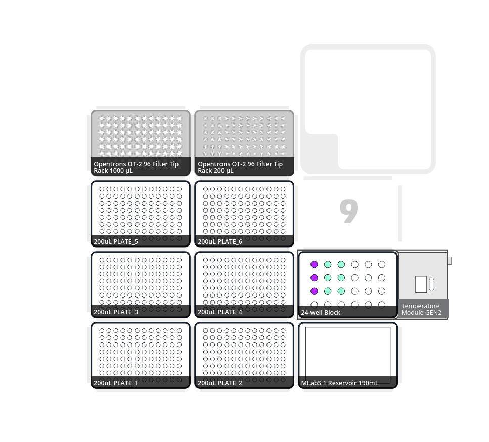
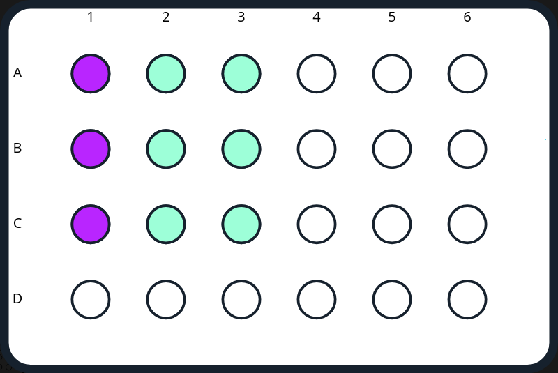
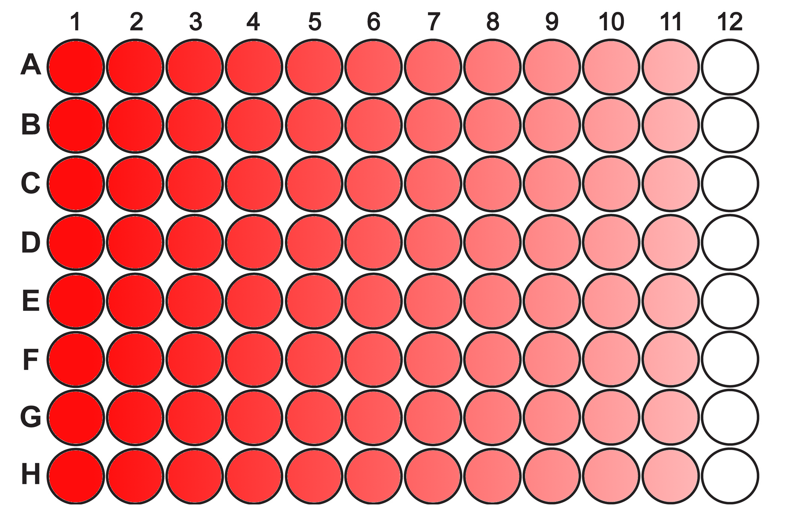

# Microdilution (v.1.0)

This is the protocol to use the Microdilution.py OT-2 Opentrons protocol to prepare 6 plates for ATB Susceptibility Testing.

To prepare the deck for the protocol you could follow the next Deck Layout:

You will need an ATB-Stock at the A1 well (A2 and A3 are prepared to be used in case of variations, but by now it only uses well A1 for ATB-stock). Also you will need 6x**STERILE** 2mL screwcap tubes in positions A2, A3, B2, B3, C2 and C3 to prepare the ATB/Media Solution to prepare the ranges of ATB on your plates.

> [!NOTE]
> You can modify the range of the AST, modifying the concentration of the ATB-Stock you use at A1-well of Aluminium Temperature Block.

| ATB STOCK CONCENTRATION | MAX. RANGE ATB TESTED (well 1) | min. RANGE ATB TESTED (well 11) |
| ----------------------- | --------------------- | --------------------- |
| 10 mg/mL | 256 mg/L | 0.12 mg/L |
| 20 mg/mL | 512 mg/L | 0.25 mg/L |
| 40 mg/mL | 1024 mg/L | 0.5 mg/L |

> [!WARNING]
> Use these material **UNDER YOUR OWN RESPONSABILITY**.

ARPBIG_MLabS'24

> [!IMPORTANT]
> Ideas for future upgrades (feel free to suggest upgrades or code modifications to do any of them):
> - [ ] Upgrading mixing function to avoid lifting pipette between mixes.
> - [ ] Initial selection of plate numbers by user.

@GCabot24
